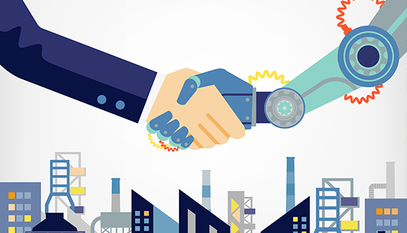
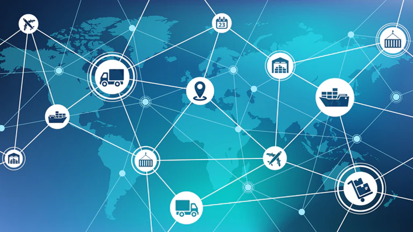

###### 

## O que é Tecnologia da Informação? 

Trecho do wikipédia que define genericamente a pergunta:  
Tecnologia da Informação (TI) é um conjunto de todas as atividades e soluções providas por recursos de computação que visam a produção, o armazenamento, a transmissão, o acesso, a segurança e o uso das informações. Na verdade, as aplicações para TI são tantas — e estão ligadas a tantas áreas — que há diversas definições para a expressão e nenhuma delas consegue determiná-la por completo. É, ainda, a área da informática que trata a informação, a organização e a classificação de forma a permitir a tomada de decisão em prol de algum objetivo. Fazendo uso de recursos computacionais físicos.  

## Como a TI está na vida das pessoas?

A TI está na vida das pessoas por meio dos computadores portáteis, computador pessoal e qualquer outro produto eletrônico que resolva problemas reais envolvendo a informação por intermédio do poder computacional que esses dispositivos podem fornecer. Dentre eles podemos citar: calculadora, mp3 player, celular, netbook, notebook, smartphone, etc. O uso efetivo da TI se dá ao fazer uma soma, reproduzir um audio, fazer uma ligação, acessar sites, etc.

## Qual o papel da TI nas Organicações?

Auxilia predominantemente em áreas de negócios de quase todos os segmentos atuais. Para uma empresa do ramo financeiro o uso da TI é visto nas transações bancarias, na facilitação que uma aplicação para o cliente pode ser possível, por exemplo, criar uma conta, fazer transferências, fazer pagamentos. Isso sem sair de casa e com o uso de um smartphone. Há ainda o uso de Inteligência Artificial pelas organizações para ajudar em tomadas de decisões de negócio baseada em varios parâmetros, uma vez que esse serviço geralmente é repetitivo e então é usado sistemas computacionais para deminiur ou o trabalho ou o número de falhas, ou ainda os dois.

----

## O que foi a Terceira revolução industrial?

  

Terceira Revolução Industrial, também conhecida como Revolução Técnico-científica, iniciou-se em meados do século XX, no período Pós-Segunda Guerra Mundial. Compreende o momento de maior avanço tecnológico, que passou a abranger não só o sistema produtivo mas também voltou-se para o campo científico, transformando as relações sociais e o dia a dia da sociedade.

Características
Iniciada na década de 1950, essa fase da Revolução Industrial caracteriza-se especialmente pela inserção da tecnologia no campo científico, atrelando-o à indústria e ao sistema produtivo. Alcançou-se, nesse período, avanços e aprimoramentos tecnológicos até então nunca vistos.

Anteriormente, destacavam-se as indústrias de metalurgia, siderurgia e a indústria automobilística. Na Terceira Revolução Industrial, destacaram-se as indústrias de alta tecnologia, desenvolvendo-se áreas da genética, robótica, informática, telecomunicações, eletrônica, entre outras.

Ao criar uma ponte entre o conhecimento científico e o sistema produtivo, modificou-se a produção, pois passou-se a produzir-se mais em menos tempo, como também a produzir-se bens e produtos antes não imaginados. A mão de obra, nessa fase, qualifica-se e passa a liderar as etapas de produção, comercialização e a gestão das empresas.

As novas invenções possibilitadas pelo avanço tecnológico, além de terem sido úteis durante a Segunda Guerra Mundial, sofreram novas modificações aprimorando-se e assumindo novas funções.

Surgiram novos meios de comunicação e aprimoram-se os antigos; criaram-se novas máquinas e instrumentos utilizados não só na indústria mas também nos laboratórios de pesquisa, e também substituiu-se a mão de obra por robôs que realizam trabalhos mais minuciosos com maior precisão. Assim, a produção elevou-se e os lucros também, na medida em que houve diminuição dos gastos com a manufatura e do tempo que se leva para chegar até o produto final.

## Como este período contribuiu para a evolução da TI e para o que a TI representa hoje no mundo dos negócios e na vida das pessoas? 

A Terceira Revolução Industrial, além de ter elevado a produção, fez com que esta fosse realizada em menos tempo e em maior escala, mudou também a relação entre as pessoas no mundo todo. As tecnologias inseridas, e que passaram a estar ao alcance da população, modificaram as formas de comunicação. As informações passaram a ser difundidas instantaneamente, alcançando pessoas do mundo todo. O rompimento de barreiras físicas e essa interligação social, econômica, política e cultural ficaram conhecidos como globalização.

  

As invenções criadas nesse período modificaram o campo científico, transformando a medicina por meio da genética, com a criação de medicamentos, novas formas de prevenção, novos tratamentos e novos instrumentos utilizados em laboratórios. Computadores, softwares, o aprimoramento da internet, chips e outros produtos eletrônicos facilitaram a vida de milhares de pessoas e impulsionaram um grande desenvolvimento econômico.

Nessa fase da Revolução Industrial, foram criadas também:

 - Telefonia móvel
 - Foguete de longo alcance
 - Utilização da energia atômica
 - Desenvolvimento da biotecnologia
 - Criação de robôs usados nas indústrias

### Referências:
 - [Tecnologia da informação - Wikipédia](https://pt.wikipedia.org/wiki/Tecnologia_da_informa%C3%A7%C3%A3o)
 - [Terceira Revolução Industrial - mundoeducacao ](https://mundoeducacao.uol.com.br/geografia/terceira-revolucao-industrial.htm)
